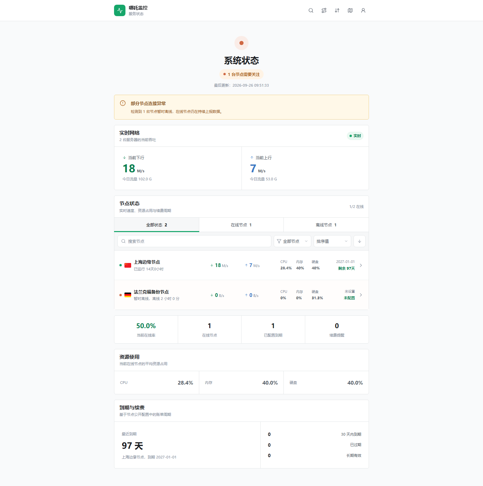

# Next Monitor Theme - NezhaDash

[极简探针](https://github.com/monitor-probe/monitor) 的公开状态页主题。布局、视觉层级与响应式行为参考 NezhaDash，保留极简探针原有的公开节点、实时 WebSocket 和历史指标接口。



## 功能

- 窄幅状态流首页，展示系统状态、实时吞吐、节点列表、平均资源和续费概览
- 节点搜索、分组、状态筛选与多字段排序
- 节点详情、资源环图、速度历史和网络延迟监控
- 桌面、平板和移动端响应式布局
- 图表与国旗资源按需加载，降低首页脚本体积
- 完整的加载、空数据、异常和离线状态
- 支持 hub 主题设置：站点公告、首页区块和详情图表开关
- 兼容旧版 hub：主题设置接口不存在时自动采用默认配置

## 主题设置

安装后可在 hub 后台的主题卡片中配置：

- 站点公告
- 实时网络、资源使用、到期续费区块是否显示
- 节点详情的速度图表和延迟图表是否显示

设置保存在 hub 数据库中，更新或重装主题不会丢失。公告按纯文本渲染，不会执行 HTML。

## 安装

可安装目录的名称必须与 `theme.json` 的 `short` 一致，结构如下：

```text
nezhadash/
├── theme.json
├── preview.png
└── dist/
    └── index.html
```

发布时将 `dist`、`theme.json` 和 `preview.png` 打入 `theme.tar.gz`，在 hub 后台主题页面上传；也可以把整个 `nezhadash` 目录放到 hub 的 `--themes` 目录。

主题前端路由为 `/` 和 `/node/{id}`。反向代理或 WAF 使用路径白名单时，需要放行 `/node/`，否则详情页刷新可能被拦截。

## 开发

```bash
npm ci
MONITOR_HUB=https://hub.example.com npm run dev
```

不设置 `MONITOR_HUB` 时，Vite 会将 `/api` 和 WebSocket 代理到 `http://127.0.0.1:9911`。

```bash
npm test
npm run lint
npm run build
npm run check:theme
```

`check:theme` 会检查 manifest、版本一致性、构建入口、文件数量、单文件大小和解压总量。GitHub Release 工作流还会检查压缩包不超过 hub 的 32 MiB 上传限制。

主题只访问官方契约中的同源接口：`/api/me`、`/api/nodes`、`/api/nodes/{id}/metrics`、`/api/ws` 和 `/api/themes/nezhadash/config`。

## 许可

MIT。国旗资源来自 [flag-icons](https://github.com/lipis/flag-icons)，采用 MIT 许可。
